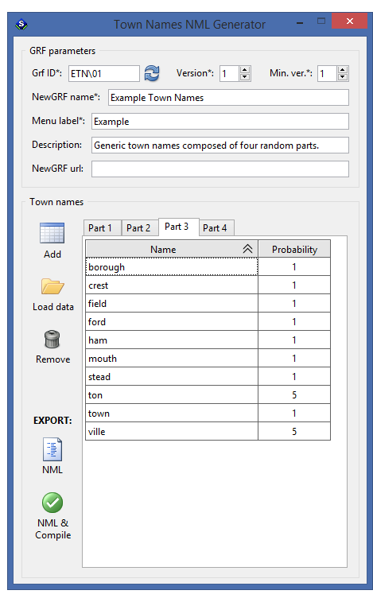

# Town Names NML Generator

**Town Names NML Generator** is a Lua-based GUI application that generates NML code for **Town Name NewGRFs** for OpenTTD.

It is designed for users with little or no experience with NML or coding. Its main goal is to make the town name generation process easy to understand, even for complete beginners.

For more detailed information, see the following resources:

- [TT-Wiki: Town names](https://newgrf-specs.tt-wiki.net/wiki/NML:Town_names)
- [TT-Wiki: Town names parts](https://newgrf-specs.tt-wiki.net/wiki/NML:Town_names_parts)

## Features

- **No coding required** — generate functional Town name NewGRFs through a practical graphical interface
- **Portable and easy to use** — lightweight Windows release, no installation needed, compiler included
- **Plain-text input** — load data from TXT files or parse comma-separated values (CSV)
- **Ready-to-use output** — produces `*.nml` source files and language files, and compiles them into a `*.grf` file usable by the game

## Installation

Download the latest **portable Windows release** from the [Releases](https://github.com/chujo-chujo/Town-Names-NML-Generator/releases) page. 
It includes all required dependencies precompiled (Lua, IUP), so no additional setup is needed. 

After extracting the contents of `Town_Names_NML_Generator-winx64-portable.zip`, start the application by running `START.bat`.

## Dependencies

This script uses the [IUP Portable User Interface](https://www.tecgraf.puc-rio.br/iup/) (`iuplua`), licensed under the terms of the MIT license. 
For the full copyright notice, go to [Tecgraf Library License](https://www.tecgraf.puc-rio.br/iup/en/copyright.html).

The standalone NML compiler [NMLC](https://github.com/OpenTTD/nml/releases) is used to compile NML code into GRF files. 
It is distributed under the GPL-2.0 license.

## Usage

For detailed instructions, screenshots, and examples, please refer to the full manual:

👉 [User Manual for Town Names NML Generator](https://chujo-chujo.github.io/Town-Names-NML-Generator/)

## Contact

If you have questions about the app, you can reach me 
**@chujo** on OpenTTD's Discord ([discord.gg/openttd](https://discord.gg/openttd))

For general questions about NML or NewGRF development, 
feel free to ask in the **`# add-on-development`** channel.

## License

This project is licensed under [CC BY-NC-SA 4.0](https://creativecommons.org/licenses/by-nc-sa/4.0/).
See the [LICENSE](./LICENSE) file for details.
